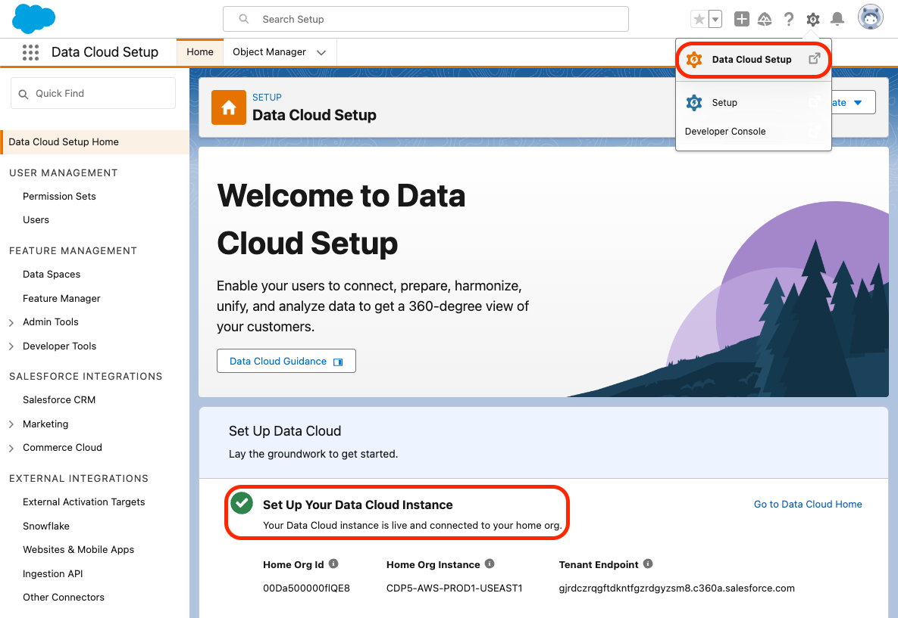

# Coral Cloud Resorts

[](https://github.com/trailheadapps/coral-cloud/actions/workflows/ci.yml)


Welcome to Coral Cloud Resorts, a sample hospitality application. Coral Cloud Resorts is a fictional resort that uses data and AI to deliver highly personalized guest experiences. It presents different ways and benefits of bringing generative AI into business workflows, including new smart automation capabilities, content generation, and summarization.

The Coral Cloud Resorts app showcases **Data Cloud**, **Agents** and **Prompts**.

## Table of contents

-   [Installation](#installation)

-   [Troubleshooting](#troubleshooting)

-   [Optional installation instructions](#optional-installation-instructions)

## Installation

### Requirements

#### Environment

The Coral Cloud Resorts app requires licenses for the following features:

-   Data Cloud
-   Agents (formerly known as Einstein Copilot)
-   Prompt Builder field generation templates
-   Einstein for Sales (for Prompt Builder sales emails)

<div>
    
    Obtain an Org with these features and learn more about the app with the <a href="https://trailhead.salesforce.com/content/learn/projects/quick-start-explore-the-coral-cloud-sample-app">Quick Start: Explore the Coral Cloud Sample App</a> Trailhead badge.
    <br/>
    <br/>
</div>

> [!IMPORTANT]
> Start from a brand-new environment to avoid conflicts with previous work you may have done.

#### Salesforce CLI

[Install the Salesforce CLI](https://developer.salesforce.com/tools/salesforcecli) or check that your installed CLI version is greater than `2.56.7` by running `sf -v` in a terminal.

If you need to [update the Salesforce CLI](https://developer.salesforce.com/docs/atlas.en-us.sfdx_setup.meta/sfdx_setup/sfdx_setup_update_cli.htm), either run `sf update` or `npm install --global @salesforce/cli` depending on how you installed the CLI.

### Step 1. Feature activation

1. Make sure that Data Cloud provisioning is complete before moving forward.

    To check this, go to **Data Cloud Setup**. The page should look like this if provisioning is complete. If you see a **Get Started** button, click it and wait for the process to complete. This can take up to ten minutes.



1. From **Setup**, go to **Einstein Setup** and click **Turn on Einstein**.

1. From **Setup**, go to **Agents** and toggle on **Einstein Copilot for Salesforce**. You may need to refresh the page to see the Agents menu after turning on Einstein.

1. From **Setup**, go to **Einstein for Sales** and ensure that **Turn on Sales Emails** is toggled on.

### Step 2. Base metadata deployment

1. Clone this repository:

    ```bash
    git clone https://github.com/trailheadapps/coral-cloud
    cd coral-cloud
    ```

1. Authorize your org with the Salesforce CLI, set it as the default org for this project and save an alias (`coral-cloud` in the command below).

    ```bash
    sf org login web -s -a coral-cloud
    ```

1. Deploy the app metadata.

    ```bash
    sf project deploy start
    ```

1. Assign the Coral Cloud permission set to the default user.

    ```bash
    sf org assign permset -n Coral_Cloud
    ```

1. Import some sample data.

    ```bash
    sf data tree import -p ./data/data-plan.json
    ```

1. Generate additional sample data with this anonymous Apex script.

    ```bash
    sf apex run -f apex-scripts/setup.apex
    ```

1. Install a Data Kit to add Data Cloud components to your org.

    ```bash
    sf package install -p 04tHr000000ku0X -w 10
    ```

1. If your org isn't already open, open it now:

    ```bash
    sf org open
    ```

## Troubleshooting

### Salesforce CLI data plan import fails with STORAGE_LIMIT_EXCEEDED

This may happen if you already have data in the org or if a previous data plan import failed and some records were saved.
To fix it, clear existing record by running the following CLI command in a terminal:

```bash
sf apex run -f apex-scripts/wipe-data.apex
```

## Optional Installation Instructions

This repository contains several files that are relevant if you want to integrate modern web development tools into your Salesforce development processes or into your continuous integration/continuous deployment processes.

### Code formatting

[Prettier](https://prettier.io/) is a code formatter used to ensure consistent formatting across your code base. To use Prettier with Visual Studio Code, install [this extension](https://marketplace.visualstudio.com/items?itemName=esbenp.prettier-vscode) from the Visual Studio Code Marketplace. The [.prettierignore](/.prettierignore) and [.prettierrc](/.prettierrc) files are provided as part of this repository to control the behavior of the Prettier formatter.

> [!IMPORTANT]
> The current Apex Prettier plugin version requires that you install Java 11 or above.

### Code linting

[ESLint](https://eslint.org/) is a popular JavaScript linting tool used to identify stylistic errors and erroneous constructs. To use ESLint with Visual Studio Code, install [this extension](https://marketplace.visualstudio.com/items?itemName=salesforce.salesforcedx-vscode-lwc) from the Visual Studio Code Marketplace. The [.eslintignore](/.eslintignore) file is provided as part of this repository to exclude specific files from the linting process in the context of Lightning Web Components development.

### Pre-commit hook

This repository also comes with a [package.json](./package.json) file that makes it easy to set up a pre-commit hook that enforces code formatting and linting by running Prettier and ESLint every time you `git commit` changes.

To set up the formatting and linting pre-commit hook:

1. Install [Node.js](https://nodejs.org) if you haven't already done so
1. Run `npm install` in your project's root folder to install the ESLint and Prettier modules (Note: Mac users should verify that Xcode command line tools are installed before running this command.)

Prettier and ESLint will now run automatically every time you commit changes. The commit will fail if linting errors are detected. You can also run the formatting and linting from the command line using the following commands (check out [package.json](./package.json) for the full list):

```bash
npm run lint
npm run prettier
```
